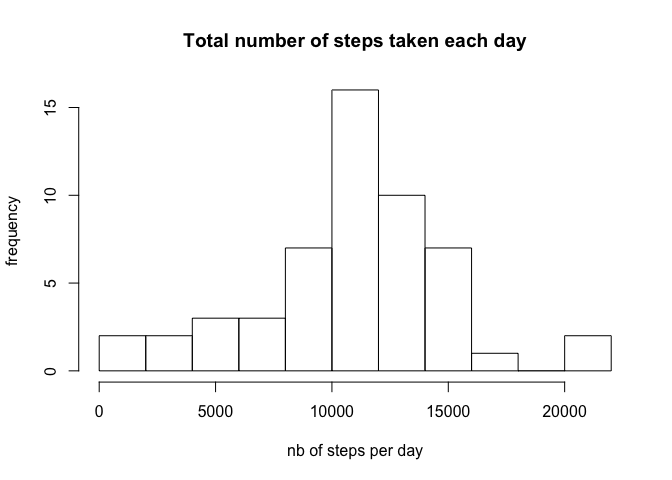
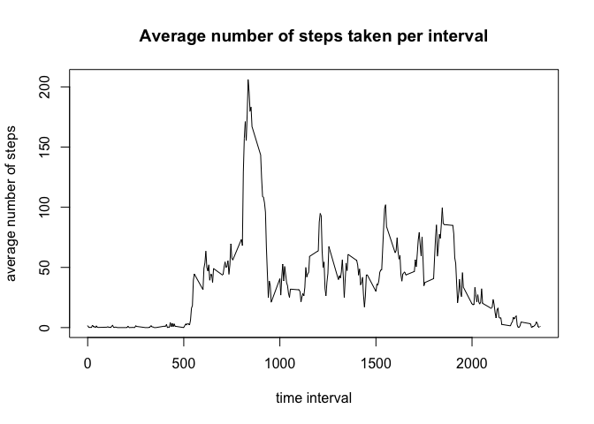
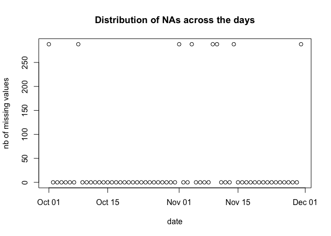
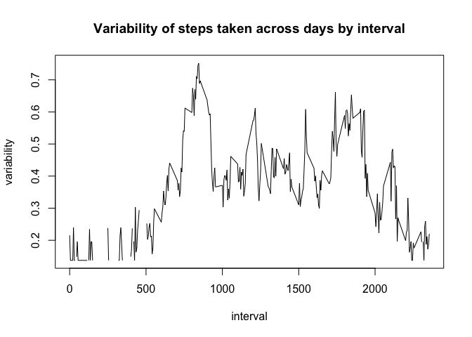
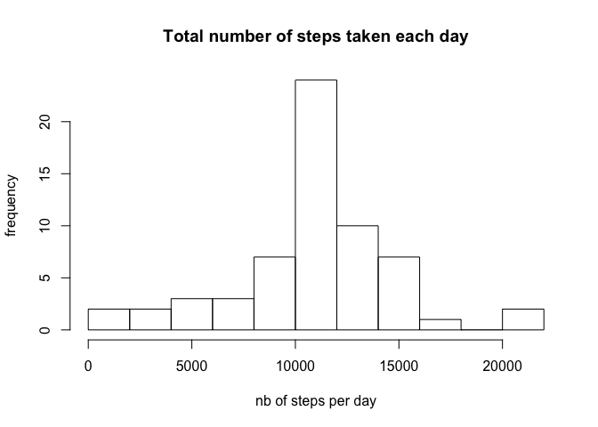
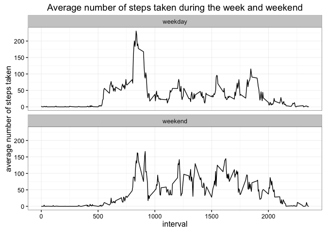

# Coursera - CourseProject
Aurelien Fauvel  
10/7/2016  


## Peer-graded Assignment: Course Project 1

## Introduction

It is now possible to collect a large amount of data about personal movement using activity monitoring devices such as a Fitbit, Nike Fuelband, or Jawbone Up. These type of devices are part of the *quantified self* movement; a group of enthusiasts who take measurements about themselves regularly to improve their health, to find patterns in their behavior, or because they are tech geeks. But these data remain under-utilized both because the raw data are hard to obtain and there is a lack of statistical methods and software for processing and interpreting the data.

This assignment makes use of data from a personal activity monitoring device. This device collects data at 5 minute intervals through out the day. The data consists of two months of data from an anonymous individual collected during the months of October and November, 2012 and include the number of steps taken in 5 minute intervals each day.

## Reading the file and summarizing the data

Let's first load the data and have a look at its structure:


```r
unzip("activity.zip", "activity.csv")
activity <- read.csv("activity.csv")
summary(activity)
```

```
##      steps                date          interval     
##  Min.   :  0.00   2012-10-01:  288   Min.   :   0.0  
##  1st Qu.:  0.00   2012-10-02:  288   1st Qu.: 588.8  
##  Median :  0.00   2012-10-03:  288   Median :1177.5  
##  Mean   : 37.38   2012-10-04:  288   Mean   :1177.5  
##  3rd Qu.: 12.00   2012-10-05:  288   3rd Qu.:1766.2  
##  Max.   :806.00   2012-10-06:  288   Max.   :2355.0  
##  NA's   :2304     (Other)   :15840
```

```r
str(activity)
```

```
## 'data.frame':	17568 obs. of  3 variables:
##  $ steps   : int  NA NA NA NA NA NA NA NA NA NA ...
##  $ date    : Factor w/ 61 levels "2012-10-01","2012-10-02",..: 1 1 1 1 1 1 1 1 1 1 ...
##  $ interval: int  0 5 10 15 20 25 30 35 40 45 ...
```

This first look at the data shows that the date variable a factor variable is, whereas we would rather have a Date variable. Let's then transform it into a Date class variable.


```r
activity$date <- as.Date(activity$date)
```

In a second step, let's look if the data is consistent with what is mentionned in the introduction (5 minutes interval, october and november) and also get a look at how many data points are missing:


```r
na <- sum(is.na(activity$steps))
nbdays <- length(unique(activity$date))
fday <- min(activity$date)
mday <- max(activity$date)
nobs <- nrow(activity)
pct <- round(na/nobs*100, digits = 1)
nobs.should <- nbdays*24*60/5
nobs.should.formated <- formatC(nobs.should, format = "d")
comp <- round(nobs/nobs.should*100, digit = 3)
```

- The dataset contains 2304 NAs among 17568 observations, so 13.1% overall.  
- The observations range from 2012-10-01 to 2012-11-30 and contain 61 days of data.
- Those number of days should account for 17568 5' interval observations, whereas we have here 17568 so we have 100% of the whole data that could have been collected (except for NAs).

## What is mean total number of steps taken per day?

We first calculate the sum of steps for each day, not counting the NA data points:


```r
s <- aggregate(steps ~ date, data = activity, sum, na.rm = TRUE)
head(s)
```

```
##         date steps
## 1 2012-10-02   126
## 2 2012-10-03 11352
## 3 2012-10-04 12116
## 4 2012-10-05 13294
## 5 2012-10-06 15420
## 6 2012-10-07 11015
```

We can then plot the histogram using the hist function with a different break argument to better understand the distribution:

```r
hist(s$steps, breaks = 10, xlab = "nb of steps per day", ylab = "frequency", 
     main = "Total number of steps taken each day")
```

<!-- -->

Let's calculate some descriptive statistics such as the mean and the median of steps taken each day:

```r
s_mean <- mean(s$steps)
s_median <- median(s$steps)
```

Across the days, the mean of steps taken (not taking account the NA observations) is 
10766 whereas the median is 10765. So both are very close to each other.

## What is the average daily activity pattern?

**1. Make a time series plot of the 5-minute interval and the average number of steps taken, averaged across all days**

Let's first calculate the average number of steps taken for each interval, using the aggregate function, and removing the NAs:


```r
s_interval <- aggregate(steps ~ interval, data = activity, mean, na.rm = TRUE)
```

Some of the descriptive statistics and a view at the data before proceeding to the plot:

```r
summary(s_interval)
```

```
##     interval          steps        
##  Min.   :   0.0   Min.   :  0.000  
##  1st Qu.: 588.8   1st Qu.:  2.486  
##  Median :1177.5   Median : 34.113  
##  Mean   :1177.5   Mean   : 37.383  
##  3rd Qu.:1766.2   3rd Qu.: 52.835  
##  Max.   :2355.0   Max.   :206.170
```

```r
head(s_interval)
```

```
##   interval     steps
## 1        0 1.7169811
## 2        5 0.3396226
## 3       10 0.1320755
## 4       15 0.1509434
## 5       20 0.0754717
## 6       25 2.0943396
```

Let's now plot the data:

```r
with(data = s_interval, plot(interval, steps, type = "l", 
                             main = "Average number of steps taken per interval", 
                             xlab = "time interval", 
                             ylab = "average number of steps"))
```

<!-- -->

**2. Which 5-minute interval, on average across all the days in the dataset, contains the maximum number of steps?**

```r
s_interval[which.max(s_interval$steps),]
```

```
##     interval    steps
## 104      835 206.1698
```

## Imputing missing values

Note that there are a number of days/intervals where there are missing values - coded as NA. The presence of missing days may introduce bias into some calculations or summaries of the data.

**1. Calculate and report the total number of missing values in the dataset - i.e. the total number of rows with NAs**

As already mentionned in the above section, we have 2304 NAs among our data, which corresponds to 13.1% overall of data points with NA.

**2. Devise a strategy for filling in all of the missing values in the dataset. The strategy does not need to be sophisticated. For example, you could use the mean/median for that day, or the mean for that 5-minute interval, etc.**

To devise such a strategy, let's briefly look at what seems to make more sense.

- How are the NAs spread across the data?

```r
activity$isna <- is.na(activity$steps)
s_na <- aggregate(isna ~ date, data = activity, sum)
summary(s_na)
```

```
##       date                 isna       
##  Min.   :2012-10-01   Min.   :  0.00  
##  1st Qu.:2012-10-16   1st Qu.:  0.00  
##  Median :2012-10-31   Median :  0.00  
##  Mean   :2012-10-31   Mean   : 37.77  
##  3rd Qu.:2012-11-15   3rd Qu.:  0.00  
##  Max.   :2012-11-30   Max.   :288.00
```

```r
with(s_na, plot(date, isna, xlab = "date", ylab = "nb of missing values", 
                main = "Distribution of NAs across the days"))
```

<!-- -->

**It looks as if the NAs appear for a complete day: either all data are properly recorded, or none**. In that case, trying the impute missing value using the day's average or mean, or by using an average of data points before or after, does not seem to make much sense.

- How variable is the number of stps taken for each interval?

```r
# Calculate the standard deviation
s_interval_sd <- aggregate(steps ~ interval, data = activity, sd, na.rm = TRUE)
# Merge the data frames with the original one to enable calculation of variability
s_interval_merge <- merge(s_interval_sd, s_interval, by = "interval")
names(s_interval_merge) <- c("interval", "sum", "sd")
# Calculate the variability per interval
s_interval_merge$variability <- s_interval_merge$sd / s_interval_merge$sum
# Plot the graphe
with(s_interval_merge, plot(interval, variability, type = "l", 
     main = "Variability of steps taken across days by interval"))
```

<!-- -->

```r
# Make a short summary of the variability
summary(s_interval_merge$variability)
```

```
##    Min. 1st Qu.  Median    Mean 3rd Qu.    Max.    NA's 
##  0.1374  0.2413  0.3676  0.3679  0.4615  0.7520      19
```

It looks as if the number of steps taken per interval is relatively variable, especially when its absolute value is high

- How variable is the number of steps taken per day, when there is no missing value?

We've seen from above that a day has either 0 NA or is full with NA. We can then calculate the variability for days without any NA in their data.


```r
# Extract data for which no missing values are present
days <- s_na[s_na$isna == 0,][,1]
s_day_nona <- s[s$date %in% days,]
# Calculate the mean variability
v <- sd(s_day_nona$steps) / mean(s_day_nona$steps)
print(v)
```

```
## [1] 0.3965359
```

The variability across days without NA looks a bit higher in average than the one across intervals.

**As a consequence, I choose to input missing values using the mean for the given interval**

**3. Create a new dataset that is equal to the original dataset but with the missing data filled in.**


```r
activity_imputed <- activity
for (i in 1:nrow(activity_imputed)) {
    if(activity_imputed$isna[i]) {
        activity_imputed$steps[i] <- s_interval$steps[s_interval$interval == activity_imputed$interval[i]]
    }
}
activity_imputed <- activity_imputed[,-4]
str(activity_imputed)
```

```
## 'data.frame':	17568 obs. of  3 variables:
##  $ steps   : num  1.717 0.3396 0.1321 0.1509 0.0755 ...
##  $ date    : Date, format: "2012-10-01" "2012-10-01" ...
##  $ interval: int  0 5 10 15 20 25 30 35 40 45 ...
```

We can then see that we have no NAs anymore in our dataset.

**4. Make a histogram of the total number of steps taken each day and Calculate and report the mean and median total number of steps taken per day. Do these values differ from the estimates from the first part of the assignment? What is the impact of imputing missing data on the estimates of the total daily number of steps?**

First, calculate the sum per day, and plot the histogram - using explicitely the same breaks as for the 1st histogram to be consistent:

```r
s_imputed <- aggregate(steps ~ date, data = activity_imputed, sum)
with(s_imputed, hist(steps, breaks = 10, xlab = "nb of steps per day", 
                     ylab = "frequency", 
                     main = "Total number of steps taken each day"))
```

<!-- -->

The mean and median can be extracted from the summary function:

```r
summary(s_imputed$steps)
```

```
##    Min. 1st Qu.  Median    Mean 3rd Qu.    Max. 
##      41    9819   10770   10770   12810   21190
```

One can then compare with the original data - for recall:

```r
summary(s$steps)
```

```
##    Min. 1st Qu.  Median    Mean 3rd Qu.    Max. 
##      41    8841   10760   10770   13290   21190
```
* Nota: the summary and mean functions do not seem to give the same result - summary of s$steps gives another result as in previous section using the mean function. A quick look on stackoverflow indicates that this is due to the rounding of the summary function. This can apparently be fixed asking summary to round differently.

## Are there differences in activity patterns between weekdays and weekends?

For this part the weekdays function may be of some help here. Use the dataset with the filled-in missing values for this part.

**1. Create a new factor variable in the dataset with two levels ??? *weekday* and *weekend* indicating whether a given date is a weekday or weekend day.**


```r
# Create first a new variable and imputing it the result of the weekdays function
activity_imputed$day.factor <- as.character(weekdays(activity$date))
# Run through the data with a for loop and impute weekday or weekend
for(i in 1:nrow(activity_imputed)) {
    if(activity_imputed$day.factor[i] == "Saturday" | 
       activity_imputed$day.factor[i] == "Sunday") {
        activity_imputed$day.factor[i] <- "weekend"
    }
    else activity_imputed$day.factor[i] <- "weekday"
}
# Transform the variable into a factor one
activity_imputed$day.factor <- as.factor(activity_imputed$day.factor)
```

**2.Make a panel plot containing a time series plot of the 5-minute interval and the average number of steps taken, averaged across all weekday days or weekend days. See the README file in the GitHub repository to see an example of what this plot should look like using simulated data.**


```r
library(ggplot2)

# Compute the average per interval
s_final <- aggregate(steps ~ interval + day.factor, data = activity_imputed, mean)

# Plot the graph, using ggplot
g <- ggplot(data = s_final, aes(interval, steps))
g + 
    geom_line() + 
    facet_wrap(~ day.factor, ncol = 1) +
    theme_bw() + 
    xlab("interval") +
    ylab("average number of steps taken") + 
    labs(title = "Average number of steps taken during the week and weekend")
```

<!-- -->

From the graphe, one can see that during the week, the average number of steps in the "early" morning is higher than during the week end. Conversely, it is higher late evening during the weekend as during the week.
